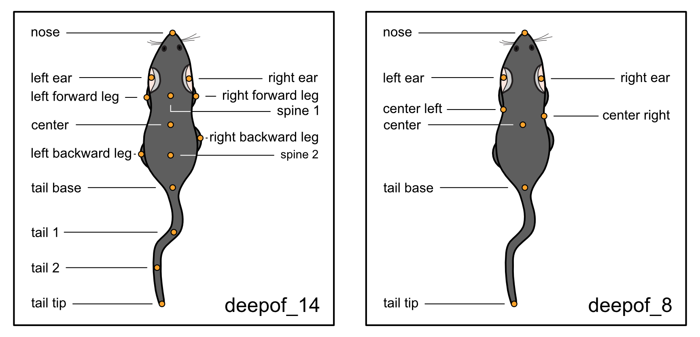

|Pipeline| |Coverage| |Docs| |CodeFactor| |Version| |MLFPM| |Black| |JOSS|

.. |Pipeline| image:: https://gitlab.mpcdf.mpg.de/lucasmir/deepof/badges/master/pipeline.svg
   :target: https://gitlab.mpcdf.mpg.de/lucasmir/deepof/-/pipelines
.. |Coverage| image:: https://gitlab.mpcdf.mpg.de/lucasmir/deepof/badges/master/coverage.svg
   :target: https://coverage.readthedocs.io/en/coverage-5.3/
.. |Docs| image:: https://readthedocs.org/projects/deepof/badge/?version=latest
   :target: https://deepof.readthedocs.io/en/latest
   :alt: Documentation Status
.. |CodeFactor| image:: https://www.codefactor.io/repository/github/lucasmiranda42/deepof/badge
   :target: https://www.codefactor.io/repository/github/lucasmiranda42/deepof
.. |Version| image:: https://img.shields.io/badge/release-v0.6.1-informational
   :target: https://pypi.org/project/deepof/
.. |MLFPM| image:: https://img.shields.io/badge/funding-MLFPM-informational
   :target: https://mlfpm.eu/
.. |Black| image:: https://img.shields.io/badge/code%20style-black-black
   :target: https://github.com/psf/black
.. |JOSS| image:: https://joss.theoj.org/papers/10.21105/joss.05394/status.svg
   :target: https://doi.org/10.21105/joss.05394
.. |Docker| image:: https://img.shields.io/badge/docker-latest-informational
   :target: https://hub.docker.com/repository/docker/lucasmiranda42/deepof/general

Welcome to DeepOF!
==================

A suite for postprocessing time-series extracted from videos of freely moving rodents using `DeepLabCut <http://www.mousemotorlab.org/deeplabcut>`_ and `SLEAP <https://sleap.ai/>`_.

.. image:: https://gitlab.mpcdf.mpg.de/lucasmir/deepof/-/raw/master/logos/deepOF_logo_w_text.png
  :width: 400
  :align: center
  :alt: DeepOF logo

Getting started
===============

You can use this package to either extract pre-defined motifs from the time series (such as time-in-zone, climbing,
basic social interactions) or to embed your data into a sequence-aware latent space to extract meaningful motifs in an
unsupervised way! Both of these can be used within the package, for example, to automatically
compare user-defined experimental groups. The package is compatible with single and multi-animal DLC 2.X, and SLEAP projects.

.. image:: _static/deepof_pipelines.png
   :width: 400
   :align: center
   :alt: DeepOF label scheme

Installation
------------

The easiest way to install DeepOF is to use `pip <https://pypi.org/project/deepof>`_. Create and activate a virtual environment with Python >=3.9 and <3.11, for example using conda:

.. code:: python

   conda create -n deepof python=3.9


Then, activate the environment and install DeepOF:

.. code:: python

   conda activate deepof
   pip install deepof


Alternatively, you can download our pre-built `Docker image <https://hub.docker.com/repository/docker/lucasmiranda42/deepof>`_,
which contains all compatible dependencies:

.. code:: bash

   # download the latest available image
   docker pull lucasmiranda42/deepof:latest
   # run the image in interactive mode, enabling you to open python and import deepof
   docker run -it lucasmiranda42/deepof

Or use `poetry <https://python-poetry.org/>`_:

.. code:: bash

   # after installing poetry and cloning the DeepOF repository, just run
   poetry install # from the main directory

**NOTE**: installation via pip is at the moment not compatible with Apple Silicon. If you'd like to install DeepOF on such machines,
please use either poetry or Docker. You should also install hdf5 using `homebrew <https://brew.sh/>`_, as described in `this <https://github.com/mlfpm/deepof/issues/15>`_ issue.

What you need
-------------

DeepOF relies heavily on DeepLabCut and SLEAP output. Thorough tutorials on how to get started with pose estimation using DLC can be found `here <https://www.mousemotorlab.org/deeplabcut>`_, and for SLEAP `here <https://sleap.ai/tutorials/tutorial.html>`_.
Once your videos are processed and tagged, you can use DeepOF to extract and annotate your motion-tracking time-series. While many features in DeepOF can work regardless of the set of labels used, we currently recommend using videos from a top-down perspective, and follow our recommended
set of labels (which can be found in the full documentation page). Pre-trained models following this scheme, and capable of recognizing either **C57Bl6** mice alone, or **C57Bl6** and **CD1** mice can be downloaded from `our repository <https://datashare.mpcdf.mpg.de/s/DKg0jd7YYqnyQv9>`_.



Basic usage
-----------

The main module with which you'll interact is called ```deepof.data```. Let's import it and create a project:

.. code:: python

   import deepof.data
   my_deepof_project = deepof.data.Project(
      project_path=".", # Path where to create project files
      video_path="/path/to/videos", # Path to DLC tracked videos
      table_path="/path/to/tables", # Path to DLC output
      project_name="my_deepof_project", # Name of the current project
      exp_conditions={exp_ID: exp_condition} # Dictionary containing one or more experimental conditions per provided video
      bodypart_graph="deepof_14" # Labelling scheme to use. See the last tutorial for details
    )

This command will create a ```deepof.data.Project``` object storing all the necessary information to start. There are
many parameters that we can set here, but let's stick to the basics for now.

One you have this, you can run you project using the ```.create()``` method, which will do quite a lot of computing under
the hood (load your data, smooth your trajectories, compute distances, angles, and areas between body parts, and save all
results to disk). The returned object belongs to the ```deepof.data.Coordinates``` class.

.. code:: python

   my_project = my_project.create(verbose=True)

Once you have this, you can do several things! But let's first explore how the results of those computations mentioned
are stored. To extract trajectories, distances, angles and/or areas, you can respectively type:

.. code:: python

   my_project_coords = my_project.get_coords(center="Center", polar=False, align="Nose", speed=0)
   my_project_dists  = my_project.get_distances(speed=0)
   my_project_angles = my_project.get_angles(speed=0)
   my_project_areas = my_project.get_areas(speed=0)

Here, the data are stored as ```deepof.data.table_dict``` instances. These are very similar to python dictionaries
with experiment IDs as keys and pandas.DataFrame objects as values, with a few extra methods for convenience. Peeping
into the parameters you see in the code block above, ```center``` centers your data (it can be either a boolean or
one of the body parts in your model! in which case the coordinate origin will be fixed to the position of that point);
```polar``` makes the ```.get_coords()``` method return polar instead of Cartesian coordinates, and ```speed```
indicates the derivation level to apply (0 is position-based, 1 speed, 2 acceleration, 3 jerk, etc). Regarding
```align``` and ```align-inplace```, they take care of aligning the animal position to the y Cartesian axis: if we
center the data to "Center" and set ```align="Nose", align_inplace=True```, all frames in the video will be aligned in a
way that will keep the Center-Nose axis fixed. This is useful to constrain the set of movements that one can extract
with our unsupervised methods.

As mentioned above, the two main analyses that you can run are supervised and unsupervised. They are executed by
the ```.supervised_annotation()``` method, and the ```.deep_unsupervised_embedding()``` methods of the ```deepof.data.Coordinates```
class, respectively.

.. code:: python

   supervised_annot = my_project.supervised_annotation()
   gmvae_embedding  = my_project.deep_unsupervised_embedding()

The former returns a ```deepof.data.TableDict``` object, with a pandas.DataFrame per experiment containing a series of
annotations. The latter is a bit more complicated: it returns a series of objects that depend on the model selected (we
offer three flavours of deep clustering models), and allow for further analysis comparing cluster expression and dynamics.

That's it for this (very basic) introduction. Check out the tutorials too see both pipelines in action, and the full API
reference for details!

Tutorials
=========

Formatting your data
--------------------
* `Formatting your data: feature extraction from motion tracking output <tutorial_notebooks/deepof_preprocessing_tutorial.ipynb>`_

Supervised and unsupervised pipelines
-------------------------------------
* `DeepOF supervised pipeline: detecting pre-defined behaviors <tutorial_notebooks/deepof_supervised_tutorial.ipynb>`_
* `DeepOF unsupervised pipeline: exploring the behavioral space <tutorial_notebooks/deepof_unsupervised_tutorial.ipynb>`_

Advanced usage
--------------
* `Using custom labelling schemes <tutorial_notebooks/deepof_custom_labels_tutorial.ipynb>`_

Cite us!
========

If you use DeepOF in your research, please consider citing:

1. `DeepOF: a Python package for supervised and unsupervised pattern recognition in mice motion tracking data (JOSS, 2023) <https://joss.theoj.org/papers/10.21105/joss.05394>`_
2. `Automatically annotated motion tracking identifies a distinct social behavioral profile following chronic social defeat stress (Nature Communications, 2023) <https://www.nature.com/articles/s41467-023-40040-3>`_

Contributing and support
========================

If you'd like to contribute to DeepOF, please check out our `contributing guidelines <https://github.com/mlfpm/deepof/blob/master/CONTRIBUTING.md>`_. If
you'd like to report a bug, suggest a new feature, or need help with general usage, please open an issue in our `issue tracker <https://github.com/mlfpm/deepof/issues>`_.

API Reference
=============

* `deepof.data (main data-wrangling module) <_generated/deepof.data.html>`_
* `deepof.utils (data-wrangling auxiliary functions) <_generated/deepof.utils.html>`_
* `deepof.models (deep unsupervised models) <_generated/deepof.models.html>`_
* `deepof.hypermodels (deep unsupervised hypermodels for hyperparameter tuning) <_generated/deepof.hypermodels.html>`_
* `deepof.annotation_utils (rule-based and supervised annotation auxiliary functions) <_generated/deepof.annotation_utils.html>`_
* `deepof.model_utils (deep machine learning models' auxiliary functions) <_generated/deepof.model_utils.html>`_
* `deepof.visuals (visualization functions) <_generated/deepof.visuals.html>`_
* `deepof.post_hoc (post-hoc analysis functions) <_generated/deepof.post_hoc.html>`_